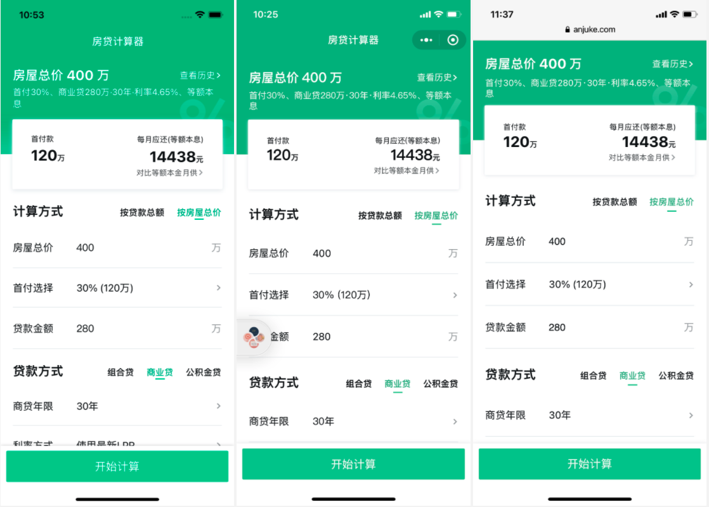
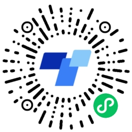

# Mortgage-Calculator

Taro 3 - MortgageCalculator 

> 从左到右：React Native、Weapp、H5



基于Taro 3开发的多端（React Native、Weapp、H5）实例


> 开发React Native， 推荐阅读[React Native 端开发流程](https://nervjs.github.io/taro/docs/3.2.0-canary.3/react-native)和[React Native 端开发前注意](https://nervjs.github.io/taro/docs/3.2.0-canary.3/react-native-remind)


### 项目介绍

目录结构：
```
├── config
├── global.d.ts
├── metro.config.js // Taro 3 RN metro 配置文件
├── package.json
├── project.config.json
├── src
│   ├── app.config.ts
│   ├── app.rn.scss // 针对RN的单独样式
│   ├── app.scss
│   ├── app.ts
│   ├── assets
│   ├── components // 封装的一些多端组件
│   ├── index.html
│   ├── pages
│   └── utils
├── tsconfig.json
└── yarn.lock
```

此项目旨在为Taro 3开发多端应用提供一个可参考的案例，封装一些支持多端的组件，提供一份开发多端应用的思路、技巧，能够快速上手开发


## 在线预览


| <center>React Native</center>| <center>小程序</center> | <center>H5</center> |
|--------------|-------|----|
| 安卓：[taroDemo.apk](https://github.com/wuba/Taro-Mortgage-Calculator/raw/dd1fa69b93ebdf737efb0a9fd7e05ba665f960c2/app-arm64-v8a-release.apk) <br> IOS：[taroDemo.app](https://github.com/wuba/Taro-Mortgage-Calculator/raw/878c4b16c7f035c9368192aa4faa7aa7fcbb8050/taroDemo.app.zip)(直接拖入IOS模拟器) |  | <br>https://wuba.github.io/Taro-Mortgage-Calculator |


## 本地运行

```
  # clone到本地
  git clone https://github.com/wuba/Taro-Mortgage-Calculator.git
  
  # 进去项目根目录
  cd Taro-Mortgage-Calculator
  
  # 安装依赖
  yarn
  
  # 运行RN 默认端口8080
  yarn dev:rn

  # 指定8081
  yarn dev:rn --port 8081

  # 运行微信小程序
  yarn dev:weapp

  # 运行H5
  yarn dev:h5
```


